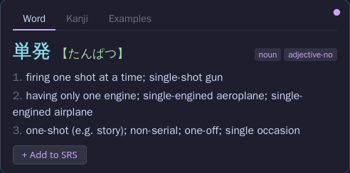
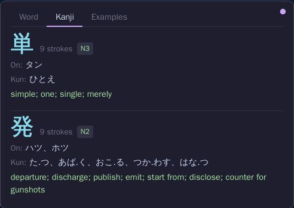
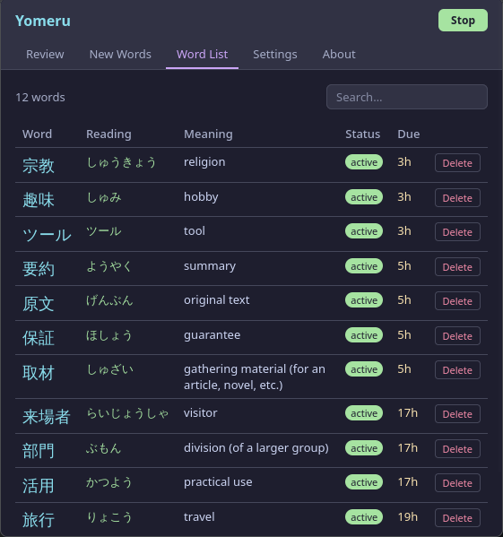

# Japanese Reader


A Firefox extension for on-hover Japanese dictionary lookup with spaced repetition (SRS) vocabulary memory.

Hover over any Japanese text on any page to see the reading, part of speech, and English definitions. The matched word is highlighted in yellow. Click **+ Add to SRS** to add it to your vocabulary deck.

Built with maximum Rust — all dictionary and SRS logic runs as WebAssembly; JavaScript is only a thin WebExtensions API bridge.

## Features

- Hover any Japanese text → popup with reading, POS tags, and glosses
- Longest-match algorithm: hovering over a conjugated form like 食べられなかった finds 食べる
- Deinflection covers ichidan, godan (all 9 types), i-adjectives, する, 来る
- Yellow highlight shows exactly which characters were matched
- Kanji tab shows on/kun readings, stroke count, JLPT level, and meanings for each kanji in the matched word
- Select Japanese text → exact dictionary lookup
- SRS deck powered by the SM-2 algorithm, cards stored in IndexedDB

## Screenshots

<table>
  <tr>
    <td></td>
    <td></td>
    <td></td>
  </tr>
  <tr>
    <td align="center">Word</td>
    <td align="center">Kanji</td>
    <td align="center">Examples</td>
  </tr>
</table>



## Install

Download the latest `.xpi` from the [Releases page](https://github.com/F4r3n/Yomeru/releases), then in Firefox open **about:addons** → gear icon → **Install Add-on From File** and select the downloaded file.

## Prerequisites (building from source)

- Firefox 112+
- Rust toolchain with the `wasm32-unknown-unknown` target: `rustup target add wasm32-unknown-unknown`
- [`wasm-pack`](https://rustwasm.github.io/wasm-pack/): `cargo install wasm-pack`
- Node.js + npm (for the TypeScript/Svelte extension build)

## Build

```bash
# Full build: download JMdict + KANJIDIC2 (if missing) → build binary indexes → compile WASM → build JS
cargo xtask build-all

# Rebuild WASM only (fast iteration)
cargo xtask build --profile dev

# Rebuild dictionary index from an existing JMdict_e XML file
cargo xtask build-dict --input JMdict_e

# Download JMdict_e.gz from EDRDG and decompress (skipped if already present)
cargo xtask download-dict

# Run tests (host crates only; WASM crates require wasm-pack)
cargo xtask test
```

## Load in Firefox

1. Open `about:debugging#/runtime/this-firefox`
2. Click **Load Temporary Add-on**
3. Select `extension/manifest.json`

## Dictionary

The extension uses [JMdict](https://www.edrdg.org/jmdict/j_jmdict.html) for word entries and [KANJIDIC2](https://www.edrdg.org/kanjidic/kanjidic_doc.html) for kanji details (Electronic Dictionary Research and Development Group). Both are downloaded from EDRDG and compiled into compact binary indexes combining an FST for fast key lookup and postcard-encoded entry data.

**Data flow:** `mousemove` (debounced 60 ms) → `extract_japanese_run(text, offset)` → `Dictionary.lookup_at(run)` (longest-match + deinflection via FST) → shadow DOM popup + CSS highlight → "+ Add to SRS" → background service worker → IndexedDB.
